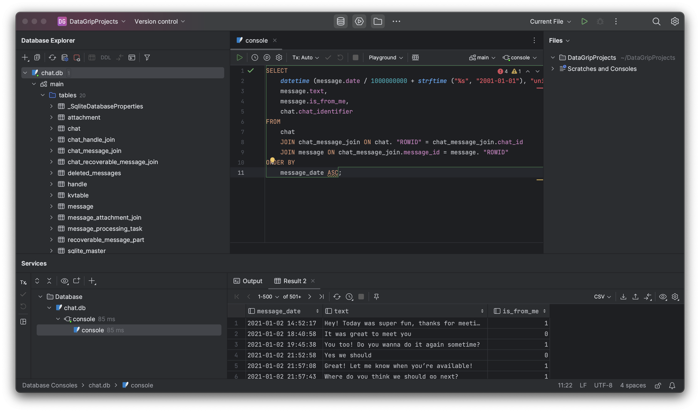
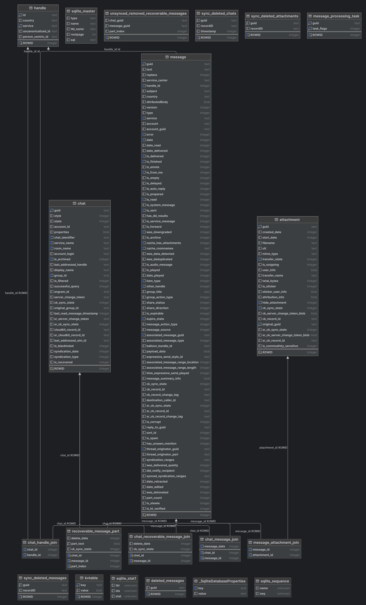

  <a name=top><p>&nbsp;
  <p align=center>
  &nbsp;<a href="/README.md#top">home</a> &nbsp; | &nbsp;
  <a href="/docs/syllabus.md#top">syllabus</a> &nbsp; | &nbsp;
  <a href="https://docs.google.com/spreadsheets/d/1sdIwdLxZ551NChuj5Pm9FCdRRhxVdVVIPgDpNg5ZFVY/edit#gid=0">groups</a> &nbsp; | &nbsp;
  <a href="https://moodle-courses2324.wolfware.ncsu.edu/course/view.php?id=4575">moodle</a> &nbsp; | &nbsp;
  <a href="https://ncsu.hosted.panopto.com/Panopto/Pages/Sessions/List.aspx?folderID=d992e131-df71-4368-940d-b064012a875c">video</a> &nbsp; | &nbsp;
  <a href="/docs/review.md">review</a> &nbsp; | &nbsp;
  <a href="/LICENSE.md#top">&copy; 2023</a><br>
  <a href="/README.md#top"></a></p><br clear=all>
  


# Databases

* Structured way to store data
* Why not just use a text file, like a CSV?
  * What if you want to store more than one table?
  * What about efficiency?
  * What about security?
  * What about concurrency?

## Relational Databases (aka, CSC540 in 10 minutes)

* Most common
* Use SQL (Structured Query Language) or its various dialects
* Tables are related to each other
* Tables have columns and rows
* Columns have a type
* Very well-optimized, based on strong theoretical foundations
  * Decades of research into concurrency, transactions, etc.
* Very mature, lots of tools and support
* Want ACID (Atomicity, Consistency, Isolation, Durability)
  * Atomicity: either the entire transaction succeeds, or it fails
  * Consistency: the database is always in a valid state
  * Isolation: concurrent transactions don't interfere with each other
  * Durability: once a transaction is committed, it is permanent
  
### SQL

* Based on relational algebra
* Includes commands, triggers, stored procedures, etc.
* Example commands: `SELECT`, `INSERT`, `UPDATE`, etc.

### How to write SQL

* The basic way: write a `.sql` file with the commands in it
  * Then run it with `sqlite3` or `psql` or whatever
  * Beginner-friendly, but not very flexible
* Alternate way: use a programming language with a SQL connector
  * Example: Python with `psycopg2` or `sqlite3`, or Java with `JDBC`
  * Important: **never** use string concatenation to build SQL queries
    * This is a huge security risk
    * Use parameterized queries instead
    * In fact, [PEP 675](https://peps.python.org/pep-0675/) uses this as a motivation
* A third way: use an ORM (Object-Relational Mapper)
  * Example: Django, SQLAlchemy, Entity Framework, etc.
  * More complex, but extremely flexible, and takes care of SQL in the background
    * Generates ugly, but very well-optimized SQL
  * We will see an example of this in C# using Entity Framework Core, using a C# feature called LINQ (Language Integrated Query).

### SQL Dialects

* SQL is a standard, but there are many dialects
* The most common are:
  * SQLite: very simple, but not very scalable
  * PostgreSQL: very powerful, but complex
  * MySQL: very popular, but not very standard
  * Microsoft SQL Server: very powerful, but expensive

## Key-Value Databases

* Very simple
* NoSQL
* No schema
* Extremely fast
* Example: DynamoDB, Redis, etc.

DynamoDB Example:
```
{
    "PersonID": 101,
    "LastName": "Smith",
    "FirstName": "Fred",
    "Phone": "555-4321"
}
{
    "PersonID": 102,
    "LastName": "Jones",
    "FirstName": "Mary",
    "Address": {
                "Street": "123 Main",
                "City": "Anytown",
                "State": "OH",
                "ZIPCode": 12345
    }
}
```

* Kinds of primary keys:
  * Simple: just a single key (called a partition key)
  * Composite: (partition key, sort key)
    * The partition key is used as a hash
* Can create a secondary index
  * Can be global (different partition key and sort key) or local (same partition key, different sort key)

## Document Databases

* NoSQL
* No schema
* Example: MongoDB, CouchDB, etc.
* In MongoDB, querying is preferred using [aggregation pipelines](https://www.mongodb.com/docs/manual/aggregation/#std-label-aggregation-pipeline-intro), which consists of a set of stages, each of which processes an input of documents (MongoDB lingo for objects), and passes the output to the next stage.

## Graph Databases

* NoSQL
* No schema
* Example: Neo4j
* Nodes and edges
* Nodes and edges can have properties
* Great for capturing semantic knowledge that links various entities.
* Example: in a study, we used ML along with a knowledge graph (ROBOKOP) to identify a clinical outcome pathway (COP) that showed a link between lower testosterone levels and increased risk of obesity in men.


# Class Activity (12 min)

Design a *key-value* database (hint: use DynamoDB docs) for the following situation. You are to implement a database for a social media platform. 
* This database needs to include fields for multiple data types, such as text, images, and videos
* Posts can have tags, or they may not. They may possess additional metadata such as location.
* Complex querying is necessary.

# Case Study: iMessage

* On macOS, iMessage messages are stored in a SQLite database, at `~/Library/Messages/chat.db`
* Part of the schema is as follows:
  * `message`: the message itself
  * `handle`: the phone number or email address of the sender
  * `chat`: the chat that the message belongs to
  * `chat_handle_join`: a join table between `chat` and `handle`
  * `attachment`: an attachment to a message
  * `message_attachment_join`: a join table between `message` and `attachment`
* Let's run some queries! [source 1](https://spin.atomicobject.com/2020/05/22/search-imessage-sql/), [source 2](https://arctype.com/blog/search-imessage/)

## Query 1: Get all messages

```sql
SELECT
    datetime (message.date / 1000000000 + strftime ("%s", "2001-01-01"), "unixepoch", "localtime") AS message_date,
    message.text,
    message.is_from_me,
    chat.chat_identifier
FROM
    chat
    JOIN chat_message_join ON chat. "ROWID" = chat_message_join.chat_id
    JOIN message ON chat_message_join.message_id = message. "ROWID"
ORDER BY
    message_date ASC;
```



## Query 2: Count messages

```sql
SELECT
    chat.chat_identifier,
    count(chat.chat_identifier) AS message_count
FROM
    chat
    JOIN chat_message_join ON chat. "ROWID" = chat_message_join.chat_id
    JOIN message ON chat_message_join.message_id = message. "ROWID"
GROUP BY
    chat.chat_identifier
ORDER BY
    message_count DESC;
```

## Query 3: Get ratio that you reply

```sql
SELECT
    h.id,
    COUNT(1) AS cnt,
    ROUND(
        SUM(
            CASE
                WHEN m.is_from_me then 1
                ELSE 0
            END
        ) * 1.0 / COUNT(1) * 100.0,
        2
    ) AS ratio
FROM
    message m
    JOIN handle h ON h.rowid = m.handle_id
GROUP BY
    h.id
ORDER BY
    cnt desc
LIMIT
    10;
```

## The ER Diagram

For those of you morbidly curious:



# A simple demo for each

## Building the Docker image

```bash
git clone https://github.com/yrahul3910/databases-demo.git
cd databases-demo
docker build -t db-demo .
```

## MySQL via EF Core

### Setup

```
/etc/init.d/mysql start
cd mysql
mysql < init.sql
```

Run `mysql`, and type the following commands:

```sql
CREATE USER 'myUsername'@'localhost' IDENTIFIED BY 'myPassword';
GRANT ALL PRIVILEGES ON db.* TO 'myUsername'@'localhost';
FLUSH PRIVILEGES;
```

### Set up a .NET Project

```
cd mysql
dotnet new console
dotnet add package Pomelo.EntityFrameworkCore.MySql
```

### Add the first database migration

Code based on [these docs](https://learn.microsoft.com/en-us/ef/core/get-started/overview/first-app?tabs=netcore-cli#install-entity-framework-core).

At this point, you would add your model's code. Instead, you will save time by checking out the code at this point:

```
git checkout ba99aa4
dotnet add package Microsoft.EntityFrameworkCore.Design
dotnet ef migrations add InitialCreate
dotnet ef database update
```

You've now updated the database! We can query it. Let's get the new code:

```
git checkout d6956e9
dotnet run
```

You should see the output:

```
Database path: /root/.local/share/blogging.db.
Inserting a new blog
Querying for a blog
Got blog with URL: http://blogs.msdn.com/adonet
Updating the blog and adding a post
Delete the blog
```

## MongoDB

### Install

```
apt-get install -y mongodb-org
systemctl start mongodb

wget https://fastdl.mongodb.org/tools/db/mongodb-database-tools-ubuntu2204-x86_64-100.9.0.deb
dpkg -i ./mongodb-database-tools-ubuntu2204-x86_64-100.9.0.deb
```

### Load data

We will use the `mongoimport` tool to do this. In the `mongo/` directory, run:

```
mongoimport --db test --file data.json --jsonArray
```

### Run example

We will now fetch the code for the example and run it:

```
git checkout be88576
node example.js
```
