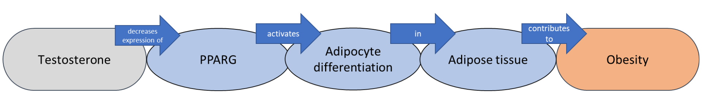

  <a name=top><p>&nbsp;
  <p align=center>
  &nbsp;<a href="/README.md#top">home</a> &nbsp; | &nbsp;
  <a href="/docs/syllabus.md#top">syllabus</a> &nbsp; | &nbsp;
  <a href="https://docs.google.com/spreadsheets/d/1sdIwdLxZ551NChuj5Pm9FCdRRhxVdVVIPgDpNg5ZFVY/edit#gid=0">groups</a> &nbsp; | &nbsp;
  <a href="https://moodle-courses2324.wolfware.ncsu.edu/course/view.php?id=4575">moodle</a> &nbsp; | &nbsp;
  <a href="https://ncsu.hosted.panopto.com/Panopto/Pages/Sessions/List.aspx?folderID=d992e131-df71-4368-940d-b064012a875c">video</a> &nbsp; | &nbsp;
  <a href="/docs/review.md">review</a> &nbsp; | &nbsp;
  <a href="/LICENSE.md#top">&copy; 2023</a><br>
  <a href="/README.md#top"></a></p><br clear=all>
  


# Databases

* Structured way to store data
* Why not just use a text file, like a CSV?
  * What if you want to store more than one table?
  * What about efficiency?
  * What about security?
  * What about concurrency?

## Relational Databases (aka, CSC540 in 10 minutes)

* Most common
* Use SQL (Structured Query Language) or its various dialects
* Tables are related to each other
* Tables have columns and rows
* Columns have a type
* Very well-optimized, based on strong theoretical foundations
  * Decades of research into concurrency, transactions, etc.
* Very mature, lots of tools and support
  
### SQL

* Based on relational algebra
* Includes commands, triggers, stored procedures, etc.
* Example commands: `SELECT`, `INSERT`, `UPDATE`, etc.

### How to write SQL

* The basic way: write a `.sql` file with the commands in it
  * Then run it with `sqlite3` or `psql` or whatever
  * Beginner-friendly, but not very flexible
* Alternate way: use a programming language with a SQL connector
  * Example: Python with `psycopg2` or `sqlite3`, or Java with `JDBC`
  * Important: **never** use string concatenation to build SQL queries
    * This is a huge security risk
    * Use parameterized queries instead
    * In fact, [PEP 675](https://peps.python.org/pep-0675/) uses this as a motivation
* A third way: use an ORM (Object-Relational Mapper)
  * Example: Django, SQLAlchemy, Entity Framework, etc.
  * More complex, but extremely flexible, and takes care of SQL in the background
    * Generates ugly, but very well-optimized SQL

### SQL Dialects

* SQL is a standard, but there are many dialects
* The most common are:
  * SQLite: very simple, but not very scalable
  * PostgreSQL: very powerful, but complex
  * MySQL: very popular, but not very standard
  * Microsoft SQL Server: very powerful, but expensive

## Key-Value Databases

* Very simple
* NoSQL
* No schema
* Extremely fast
* Example: DynamoDB, Redis, etc.

DynamoDB Example:
```
{
    "PersonID": 101,
    "LastName": "Smith",
    "FirstName": "Fred",
    "Phone": "555-4321"
}
{
    "PersonID": 102,
    "LastName": "Jones",
    "FirstName": "Mary",
    "Address": {
                "Street": "123 Main",
                "City": "Anytown",
                "State": "OH",
                "ZIPCode": 12345
    }
}
```

* Kinds of primary keys:
  * Simple: just a single key (called a partition key)
  * Composite: (partition key, sort key)
    * The partition key is used as a hash
* Can create a secondary index
  * Can be global (different partition key and sort key) or local (same partition key, different sort key)

## Document Databases

* NoSQL
* No schema
* Example: MongoDB, CouchDB, etc.
* In MongoDB, querying is preferred using [aggregation pipelines](https://www.mongodb.com/docs/manual/aggregation/#std-label-aggregation-pipeline-intro), which consists of a set of stages, each of which processes an input of documents (MongoDB lingo for objects), and passes the output to the next stage.

## Graph Databases

* NoSQL
* No schema
* Example: Neo4j
* Nodes and edges
* Nodes and edges can have properties
* Great for capturing semantic knowledge that links various entities.
* Example: in a study, we used ML along with a knowledge graph (ROBOKOP) to identify a clinical outcome pathway (COP) that showed a link between lower testosterone levels and increased risk of obesity in men.



# Class Activity (12 min)

Design a *key-value* database (hint: use DynamoDB docs) for the following situation. You are to implement a database for a social media platform. 
* This database needs to include fields for multiple data types, such as text, images, and videos
* Posts can have tags, or they may not. They may possess additional metadata such as location.
* Complex querying is necessary.


